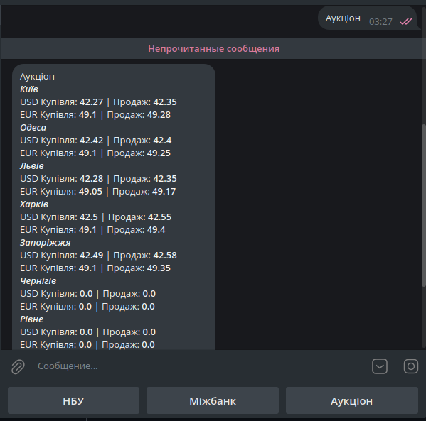
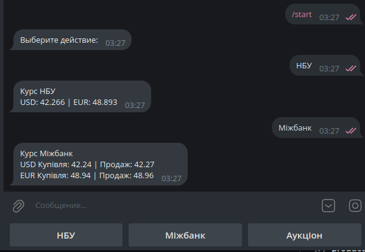

# TGB‑EUR‑USD‑ukrainian‑rate

## 🇺🇦 Опис
**Telegram бот на Python**, який показує актуальні курси валют в Україні.  

Бот парсить дані з **minfin.com.ua** та виводить:  
- офіційний курс Нацбанку  
- міжбанківський курс  
- курси в різних містах країни  

Управління ботом здійснюється **безпосередньо у Telegram-чаті** за допомогою команд.

## 🇬🇧 Description
**Telegram Bot in Python** that displays current currency exchange rates in Ukraine.  

The bot parses data from **minfin.com.ua** and provides:  
- official National Bank rates  
- interbank rates  
- rates in different cities of Ukraine  

Bot control is done **directly in the Telegram chat** via commands.

---

## 🛠 Технології / Technologies

- Python 3.x  
- Telegram Bot API (aiogram або pyTelegramBotAPI)  
- requests / BeautifulSoup для парсингу / for parsing  
- CSV/JSON (опційно для збереження даних / optional for saving data)  

---

## ⚡ Функціонал / Features

- `/start` — привітальне повідомлення та інструкції / welcome message and instructions  
- `НБУ` — показує актуальні курси EUR/USD НБУ / shows current EUR/USD NBU rates
- `Міжбанк` — показує актуальні курси EUR/USD Міжбанк / shows current EUR/USD Interbank rates
- `Аукціон` — показує актуальні курси EUR/USD Міста України / shows current EUR/USD rates Cities of Ukraine
- Всі дії виконуються через Telegram-чат / all actions are done via Telegram chat  

---

## 🚀 Як запустити / How to run

1. Клонувати репозиторій / clone repository:
```bash
git clone https://github.com/slysinema/TGB-EUR-USD-ukrainian-rate.git
```
2. Встановити залежності / install dependencies:
```bash
pip install -r requirements.txt
```
3. Додати токен Telegram бота у файл main.py / add your Telegram bot token to main.py:
```
TELEGRAM_TOKEN = "YOUR_TOKEN_HERE"
```
4. Запустити бота / run the bot:
```
python bot.py
```
## 📌 Можливості для розвитку / Potential improvements

- Додавання курсу інших валют / Adding more currencies
- Додавання графіків змін курсів / Adding currency trend charts
- Інтеграція з push-сповіщеннями / Integration with push notifications

## 📸 Скріншоти / Screenshots

*Приклад взаємодії користувача з Telegram ботом.*  
*Example of user interaction with Telegram bot.*  
  
  


